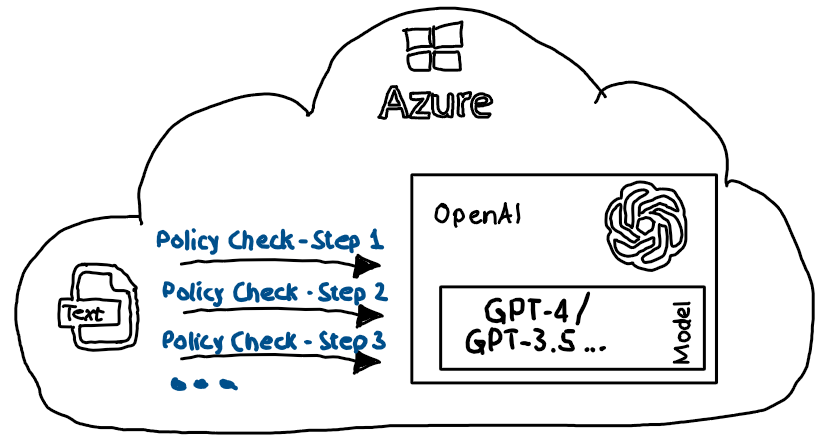
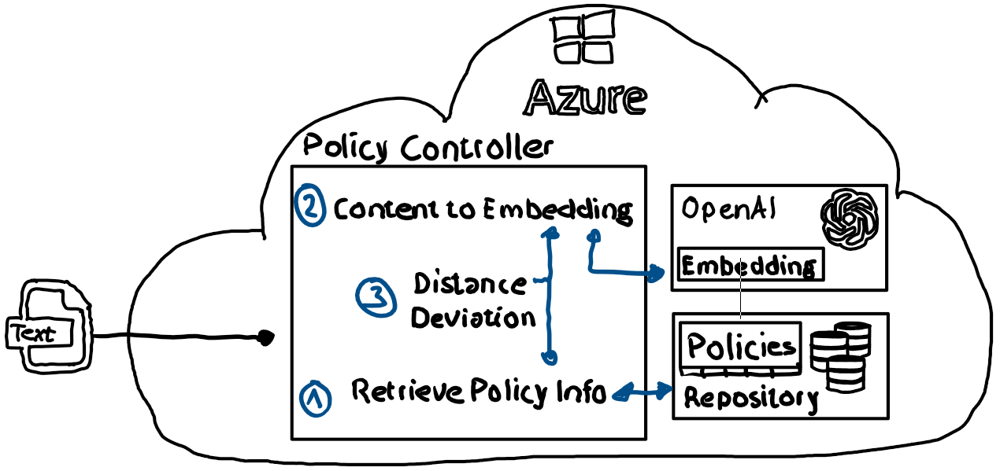
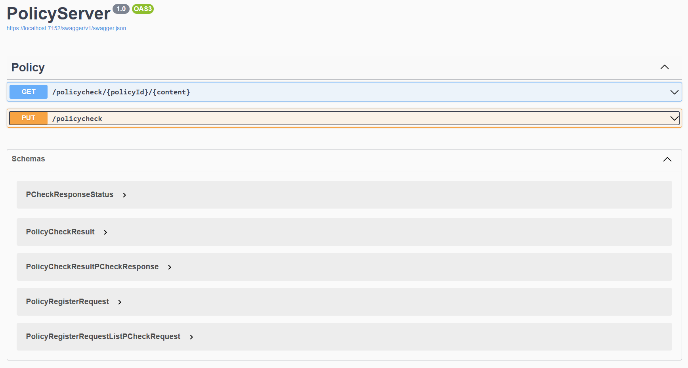

# OpenAI - Use Embeddings to optimize LLM requests

## Challenge

LLMs (Large Language Models) like chatGPT can help extract insights from provided text by utilizing their natural language processing capabilities to identify patterns, relationships, and key information within the text, enabling a deeper understanding of its content; to analyze if a provided input text complies with policies like GDPR or even custom defined policies.

Complex or multi-step policies may necessitate multiple calls to the LLM in order to comprehensively asses text content, such as first identifying the presence of intelligence information and then employing custom, discrete checks tailored to the specific finding. Strategies to tailor a custom prompt which addresses the challenge might end in an unwieldy and hard to manage prompt.

Token limits, performance and associated costs pose another challenge as not unlimited text at a high frequency can be provided to the LLM to get analyzed for potential certain policy violations.



## Embeddings

Embeddings are numerical representations of words or phrases that capture semantic relationships and conserve the semantic meaning, enabling them to be used to contextualize and enrich LLM calls with relevant information.

Embeddings can be employed to check if provided text contains expected content by measuring the semantic similarity between the provided text and a predefined expected phrase or text, thereby distinguishing the most contextually relevant responses.

## Repo Content

In this [c# sample application](./src) embeddings are utilized to "semantically compare" provided text against predefined statements. Allowing the application to identify probability if provided text is compliant or non-compliant with a specific policy check.

### Policy Definition

In the context of this simplified demo application a policy is a single task or check which can be executed against provided text. As a sample it will be checked if in provided content a "semantic near" phrase like "What's your PIN" has been provided. If the "semantic near" phrase has been provided the policy can be seen as respected.

**Policy**:

A policy can be defined by providing the following information:

- ***"PolicyID"***: A unique ID for the policy
- ***"ContentToLookFor"***: A phrase, question, or content that, when mentioned in the conversation, validates the policy. In the specific example it is the question "What's your PIN?". If the question was asked, authentication was done according to the policy.
- ***PotentialPhrases***: An array of additional phrases which would fulfill the policy.
- ***OffTopicPhrases***: An array of questions or content which is related but does not validate the policy.

```json
    { 
      "PolicyId": "Auth-KnowHow-01",
      "ContentToLookFor": "What's your PIN?",
      "PotentialPhrases": [
        "Can you tell me your PIN?",
        "What's your Personal Identification Number?",
        "What's your PIN number?"
      ], 
      "OffTopicPhrases": [
        "What's your bank account?",
        "What business are you doing?"
      ]
    }
```

### Policy registration

Policies can be registered with the system by performing a HTTP put against the [*/policycheck* endpoint](./src/PolicyServer/Controllers/PolicyController.cs). As payload an [object of type](./src/PolicyServer/Models/PCheckPolicyModels.cs) `PCheckRequest<List<PolicyRegisterRequest>>` is expected.

The following steps are executed during policy registration and policy storage in a [repository](./src/PolicyServer/Util/Repository/PolicyRepository.cs):

- Embedding creation for "ContentToLookFor" using Azure OpenAI and a deployed embedding model.
- Embedding creation for each entry in "PotentialPhrases" and "OffTopic".
- Calculation of the cosine distance to "ContentToLookFor" for both "PotentialPhrases" and "OffTopicPhrases".

### Policy Check

Policy compliance can be checked by performing a HTTP get against the [*/policycheck* endpoint](./src/PolicyServer/Controllers/PolicyController.cs). The Id of the policy and the content which should be checked, needs to be provided.

The policy check performs the following steps:



1) Retrieve registered policy. This includes the embedding for "ContentToLookFor" and average cosine distance for "Potential Phrases" and "OffTopicPhrases"
2) Create embedding out of the provided "content"
3) Calculate the cosine difference between "content" and "ContentToLookFor". Calculate deviation (%) from the average "OffTopicPhrases" and "PotentialPhrases" distances.

By analyzing the above results a solid indication if the policy was respected can be provided.

### Sample

- Start the asp.net server by pressing F5 (VSCode/Visual Studio) or execute `dotnet build` in the [project folder](./src/PolicyServer/). Please provide your Azure OpenAI API key, Azure OpenAI endpoint and embedding deployment name in [appsettings.json](./src/PolicyServer/appsettings.json)
```dotnetcli
{
  "Logging": {
    "LogLevel": {
      "Default": "Information",
      "Microsoft.AspNetCore": "Warning"
    }
  },
  "AllowedHosts": "*"
  "PCheck_AOAI_APIKEY": "<<your api key>", 
  "PCheck_AOAI_ENDPOINT": "<<your endpint>>",
  "PCheck_AOAI_EMBEDDINGDEPLOYMENTNAME": "<<your embedding deployment name>"
}
```
 
- A browser will open showing the swagger interface:
  
- Choose the second option (PUT /policycheck)
- Provide the content from [this JSON file](./request_data/PUT-PolicyCheck.json) as payload and execute the call. This will register 4 policies. (This step is optional as the application loads policies during startup also from [here](./preloaded_policies/))
- Choose the first option (GET /policychec/{policyId}/{content}) and provide the following values:
  - policyId: ***Auth-KnowHow-01***
  - content: ***What's your PIN or PINs?***
    - Check the response

      ```json
      {
        "Result": {
          "CalculatedDistance": 0.04175709,
          "AvgOptimalDistance": 0.054822758,
          "AvgOffTopicDistance": 0.17467114,
          "DeviationOptimalDistance": 23.832565,
          "DeviationOffTopicDistance": 242.4432
        },
        "Status": 0,
        "Error": []
      }
      ```

      - `CalculatedDistance` is the distance between content (= What's your PIN or PIN's?") and "ContentToLookFor" of the policy. 
      - `CalculatedDistance` smaller than `AvgOptimalDistance` indicates that the provided content has an "semantically nearer" meaning than the average of "PotentialPhrases". A strong indicator that the policy is respected.
      - `DeviationOptimalDistance` and `DeviationOffTopicDistance` show the respective deviation in %.
  - Redo with content: ***Can you tell me your age?***
    - Check the response

      ```json
      {
        "Result": {
           "CalculatedDistance": 0.17989132,
           "AvgOptimalDistance": 0.054822758,
           "AvgOffTopicDistance": 0.17467114,
           "DeviationOptimalDistance": -228.13255,
           "DeviationOffTopicDistance": -9.521912
        },
        "Status": 0,
        "Error": []
      }
      ```

    - It shows a 228.13255 deviation from the avg optimal distance

### Next Steps

The above architecture is designed to support human as well as AI supported reinforcement learning.

This can be achieved by defining certain thresholds. E.g., a threshold for the deviation of provided content from the avg. "PotentialPhrases" and "OffTopicPhrases" differences. If the threshold is met a human can decide if the policy has been respected or a LLM completion call with a custom policy specific prompt can be executed.

The results of human interaction or LLM response can be stored to improve further similar checks.